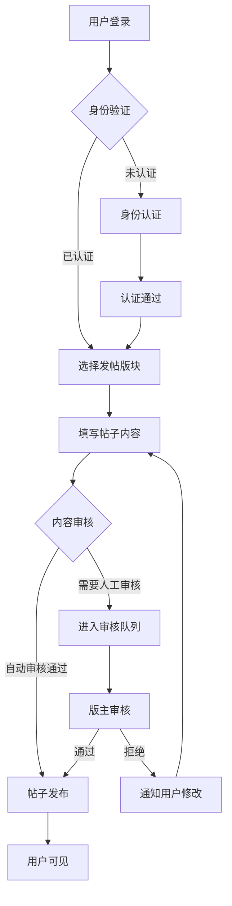
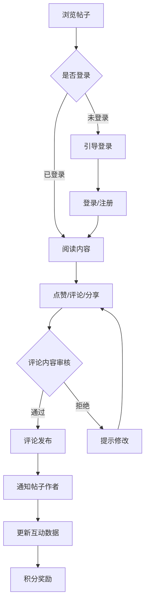
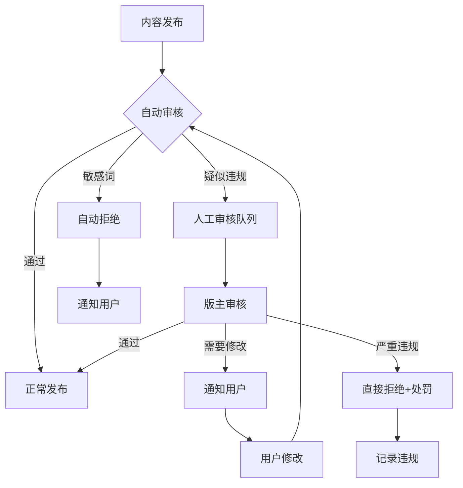
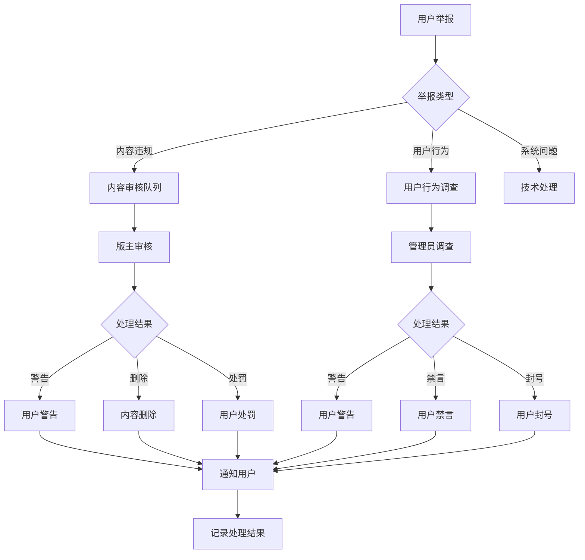

# QQClub 论坛交流模块 - 业务设计

## 📋 文档说明

**目标读者**: 产品经理、业务分析师、项目相关方
**文档内容**: 论坛模块的业务流程、用户角色、激励机制、社区治理
**与其他文档关系**: 本文档详细描述论坛业务逻辑，技术实现请参考 [论坛技术设计](forum-technical.md)

---

## 🎯 业务目标与价值

### 核心业务目标
1. **建立活跃社区**: 打造用户乐于参与的讨论空间
2. **促进知识分享**: 鼓励有价值的内容创作和分享
3. **增强用户粘性**: 通过社区互动提升用户留存
4. **培养社区文化**: 建立积极健康的社区氛围

### 商业价值
- **用户增长**: 通过优质内容吸引新用户
- **活跃度提升**: 增加用户使用频率和时长
- **品牌建设**: 建立QQClub在读书社区的品牌认知
- **数据价值**: 积累用户行为数据，支持产品优化

---

## 👥 用户角色体系

### 角色定义与权限

#### 1. 系统管理员 (System Admin)
**权限范围**: 全局系统管理
- 系统配置和参数管理
- 所有用户数据和内容的完全控制
- 社区管理员和版主的任命与管理
- 系统监控和故障处理

**职责**:
- 维护系统正常运行
- 制定平台政策和规则
- 处理重大安全事件
- 监控平台整体运营状况

#### 2. 社区管理员 (Community Manager)
**权限范围**: 社区整体运营管理
- 论坛版块设置和管理
- 内容审核标准的制定和执行
- 用户投诉和纠纷处理
- 版主团队的组建和管理

**职责**:
- 制定社区运营策略
- 监控社区内容和氛围
- 组织社区活动和话题
- 处理用户反馈和建议

#### 3. 版主 (Moderator)
**权限范围**: 特定版块的管理
- 版块内内容的审核和管理
- 用户违规行为的处理
- 版块话题的引导和管理
- 优质内容的推荐和置顶

**职责**:
- 维护版块内讨论秩序
- 引导优质内容创作
- 处理版块内用户举报
- 参与版块内容策划

#### 4. 普通用户 (Regular User)
**权限范围**: 基础内容创作和互动
- 发帖、评论、点赞
- 关注其他用户
- 个人主页管理
- 参与社区活动

**职责**:
- 遵守社区规则
- 积极参与讨论
- 举报违规内容
- 维护良好社区氛围

#### 5. 新用户 (New User)
**权限范围**: 有限制的浏览权限
- 浏览公开内容
- 查看其他用户资料
- **限制**: 发帖、评论需要实名认证或满足条件

**职责**:
- 了解社区规则
- 完成身份认证
- 熟悉平台功能
- 逐步参与社区活动

### 角色晋升机制

#### 新用户 → 普通用户
**条件**:
- 完成身份认证（实名制）
- 阅读社区规则并通过测试
- 注册满24小时

#### 普通用户 → 版主
**条件**:
- 活跃度达标（月均发帖≥10篇）
- 内容质量优秀（优质内容占比≥30%）
- 无违规记录
- 通过版主申请和面试

#### 版主 → 社区管理员
**条件**:
- 版主工作满6个月
- 版块运营效果优秀
- 具备团队管理能力
- 通过管理员考核

---

## 🔄 核心业务流程

### 流程1: 内容发布流程



**详细规则**:
- **发帖限制**: 新用户需认证后才能发帖
- **内容审核**: 敏感词过滤 + 人工审核机制
- **发布频率**: 防刷机制，同一用户发帖间隔≥5分钟
- **内容质量**: 标题、内容长度要求，避免低质量内容

### 流程2: 内容互动流程



**激励机制**:
- **评论奖励**: 有价值评论获得积分奖励
- **点赞互动**: 点赞行为获得少量积分
- **分享传播**: 分享到外部平台获得额外奖励
- **优质内容**: 获得较多互动的内容有额外奖励

### 流程3: 内容审核流程



**审核标准**:
- **一级违规**: 违法内容、严重人身攻击，直接封号
- **二级违规**: 广告刷屏、不当内容，禁言7-30天
- **三级违规**: 轻微违规、内容质量低，警告并要求修改
- **审核时效**: 人工审核响应时间≤2小时

### 流程4: 用户举报处理流程



---

## 💰 激励机制设计

### 积分系统

#### 积分获取规则
| 行为类型 | 积分奖励 | 每日上限 | 说明 |
|----------|----------|----------|------|
| 发帖 | +10分 | 50分 | 原创内容获得基础积分 |
| 评论 | +2分 | 20分 | 有意义评论获得积分 |
| 获得点赞 | +1分 | 30分 | 每个点赞获得积分 |
| 优质内容 | +50分 | 100分 | 版主推荐的优质内容 |
| 每日签到 | +1分 | 1分 | 保持活跃度 |
| 举报违规 | +5分 | 20分 | 举报属实获得奖励 |

#### 积分消耗规则
| 行为类型 | 积分消耗 | 说明 |
|----------|----------|------|
| 置顶帖子 | 100分 | 个人帖子置顶7天 |
| 特殊头像 | 500分 | 解锁特殊头像框 |
| 个性签名 | 200分 | 设置个性化签名 |
| 广告位购买 | 1000分 | 个人推广位 |

### 等级体系

#### 用户等级设计
```
Level 1: 新手 (0-100分)
Level 2: 学徒 (101-500分)
Level 3: 学者 (501-2000分)
Level 4: 专家 (2001-5000分)
Level 5: 大师 (5001-10000分)
Level 6: 宗师 (10001+分)
```

#### 等级权益
| 等级 | 发帖权限 | 评论权限 | 特殊功能 | 徽章展示 |
|------|----------|----------|----------|----------|
| 新手 | ❌ | ❌ | 无 | 新手徽章 |
| 学徒 | ✅ | ✅ | 基础功能 | 学徒徽章 |
| 学者 | ✅ | ✅ | 置顶权限 | 学者徽章 |
| 专家 | ✅ | ✅ | 优先推荐 | 专家徽章 |
| 大师 | ✅ | ✅ | 版块管理 | 大师徽章 |
| 宗师 | ✅ | ✅ | 平台特权 | 宗师徽章 |

### 徽章系统

#### 成就徽章
- **创作达人**: 累计发帖100篇
- **评论能手**: 累计评论500条
- **人气王**: 获得点赞1000个
- **优质贡献者**: 优质内容50篇
- **社区卫士**: 有效举报100次
- **元老用户**: 注册满2年

#### 特殊徽章
- **月度之星**: 当月贡献最大
- **最佳新人**: 新用户中表现突出
- **版主推荐**: 版主特别推荐
- **活动达人**: 积极参与社区活动

---

## 🛡️ 社区治理机制

### 内容规则体系

#### 禁止内容
1. **违法内容**: 涉及违法犯罪的信息
2. **人身攻击**: 侮辱、诽谤、歧视性言论
3. **广告刷屏**: 商业广告、重复内容
4. **不当内容**: 色情、暴力、政治敏感内容
5. **侵权内容**: 侵犯他人知识产权的内容

#### 鼓励内容
1. **原创分享**: 个人的读书心得、经验总结
2. **深度讨论**: 有见地的观点和分析
3. **互助回答**: 帮助其他用户解决问题
4. **优质资源**: 有价值的书籍、资料推荐
5. **建设性意见**: 对平台发展的建议

### 审核机制设计

#### 自动审核
- **敏感词过滤**: 实时检测敏感词汇
- **图片识别**: 自动识别违规图片内容
- **重复检测**: 防止重复发帖和刷屏
- **行为分析**: 识别异常发帖行为

#### 人工审核
- **审核团队**: 版主 + 管理员组成审核团队
- **审核标准**: 统一的审核标准和流程
- **响应时间**: 工作时间内2小时内响应
- **审核记录**: 所有审核操作都有记录

### 用户处罚机制

#### 处罚类型
1. **警告**: 口头警告，不限制功能
2. **禁言**: 禁止发帖评论7-30天
3. **降级**: 降低用户等级和权限
4. **封号**: 永久禁止使用平台

#### 处罚流程
1. **违规认定**: 通过举报或审核发现违规
2. **证据收集**: 保存违规证据和记录
3. **处罚决定**: 根据违规程度确定处罚
4. **通知用户**: 告知处罚原因和期限
5. **申诉渠道**: 提供申诉和复议机制

---

## 📊 运营策略

### 内容运营

#### 话题引导
- **每日话题**: 版主推荐当日讨论话题
- **专题活动**: 定期组织专题讨论活动
- **优质推荐**: 推荐优质内容到首页
- **用户故事**: 分享用户成长和成功案例

#### 用户运营
- **新人引导**: 新用户注册后的引导流程
- **活跃激励**: 通过积分和等级激励活跃用户
- **流失召回**: 针对流失用户的召回策略
- **核心用户**: 重点维护核心贡献用户

### 数据监控

#### 关键指标
- **内容指标**: 发帖量、评论量、互动率
- **用户指标**: DAU、MAU、留存率、流失率
- **质量指标**: 优质内容占比、违规率、举报率
- **社区指标**: 用户满意度、NPS评分

#### 监控工具
- **实时监控**: 内容发布和互动实时监控
- **定期报告**: 周报、月报数据分析
- **预警机制**: 异常情况自动预警
- **用户反馈**: 收集和分析用户反馈

---

## 📈 商业化规划

### 广告系统
- **展示广告**: 顶部、侧边栏广告位
- **信息流广告**: 内容流中的原生广告
- **精准投放**: 基于用户兴趣的精准广告
- **广告收益**: 与广告主分成的收益模式

### 会员服务
- **高级会员**: 去广告、高级功能、专属徽章
- **企业服务**: 企业版社区、定制功能
- **咨询服务**: 读书指导、社区运营咨询
- **培训服务**: 社区运营培训、内容创作培训

### 电商整合
- **图书推荐**: 结合论坛讨论推荐图书
- **文创产品**: QQClub周边产品销售
- **服务交易**: 用户间技能和知识服务
- **会员电商**: 会员专属优惠和产品

---

## 📝 实施计划

### 第一阶段：基础功能 (1-2个月)
- [x] 用户发帖和评论功能
- [x] 基础的内容展示和浏览
- [x] 简单的用户管理
- [x] 基础的内容审核机制

### 第二阶段：社区治理 (2-3个月)
- [ ] 完整的内容审核体系
- [ ] 用户举报和处理机制
- [ ] 版主管理系统
- [ ] 积分和等级系统

### 第三阶段：运营工具 (3-4个月)
- [ ] 数据分析和监控工具
- [ ] 用户运营工具
- [ ] 内容推荐系统
- [ ] 社区活动功能

### 第四阶段：商业化 (4-6个月)
- [ ] 广告系统
- [ ] 会员服务
- [ ] 电商整合
- [ ] API开放平台

---

## 🔗 相关文档

### 论坛模块内部文档
- **[论坛总览](forum-overview.md)** - 模块整体介绍
- **[论坛用户体验设计](forum-ux.md)** - 界面和交互设计
- **[论坛技术设计](forum-technical.md)** - 技术架构和实现
- **[论坛API规范](forum-api.md)** - API接口文档
- **[论坛数据库设计](forum-database.md)** - 数据模型设计
- **[论坛实施指南](forum-implementation.md)** - 开发和部署指南

### 其他模块文档
- **[共读活动模块](../reading-event/reading-event-business.md)** - 共读活动业务设计
- **[整体业务分析](../../business/BUSINESS_ANALYSIS.md)** - 平台整体业务战略

---

*本文档最后更新: 2025-10-17*