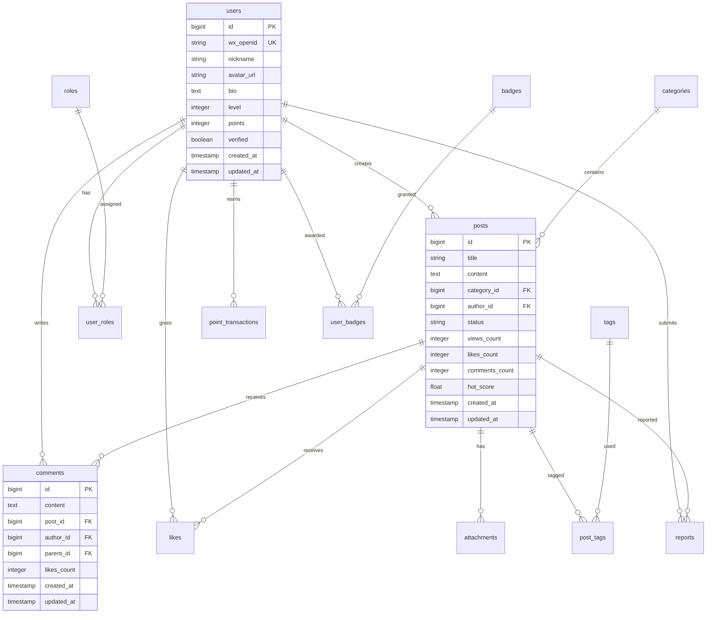

# QQClub 论坛交流模块 - 数据库设计

## 📋 文档说明

**目标读者**: 后端开发者、数据库管理员、系统架构师
**文档内容**: 论坛模块的数据库模型设计、表结构、索引优化、数据迁移
**与其他文档关系**: 本文档详细描述数据库设计，业务逻辑请参考 [论坛业务设计](forum-business.md)

---

## 🗄️ 数据库架构概览

### 设计原则
- **规范化**: 遵循第三范式，减少数据冗余
- **性能优化**: 合理设计索引，支持高并发查询
- **扩展性**: 考虑未来功能扩展的表结构设计
- **数据完整性**: 外键约束和检查约束保证数据一致性
- **分区策略**: 对大表进行分区，提升查询性能

### 核心实体关系图


---

## 👥 用户管理相关表

### 1. users 表 - 用户基础信息
```sql
CREATE TABLE users (
    id BIGSERIAL PRIMARY KEY,
    wx_openid VARCHAR(100) UNIQUE NOT NULL,
    nickname VARCHAR(50) NOT NULL,
    avatar_url VARCHAR(500),
    bio TEXT,
    email VARCHAR(100),
    phone VARCHAR(20),
    level INTEGER DEFAULT 1,
    points INTEGER DEFAULT 0,
    verified BOOLEAN DEFAULT FALSE,
    status INTEGER DEFAULT 1, -- 1:正常 2:禁言 3:封号
    last_active_at TIMESTAMP,
    created_at TIMESTAMP DEFAULT CURRENT_TIMESTAMP,
    updated_at TIMESTAMP DEFAULT CURRENT_TIMESTAMP
);

-- 索引
CREATE INDEX idx_users_wx_openid ON users(wx_openid);
CREATE INDEX idx_users_level ON users(level);
CREATE INDEX idx_users_status ON users(status);
CREATE INDEX idx_users_last_active ON users(last_active_at);
CREATE INDEX idx_users_created_at ON users(created_at);
```

### 2. roles 表 - 角色定义
```sql
CREATE TABLE roles (
    id SERIAL PRIMARY KEY,
    name VARCHAR(50) UNIQUE NOT NULL,
    display_name VARCHAR(100) NOT NULL,
    description TEXT,
    permissions JSONB, -- 权限配置
    level INTEGER DEFAULT 0, -- 角色等级，数值越大权限越高
    created_at TIMESTAMP DEFAULT CURRENT_TIMESTAMP,
    updated_at TIMESTAMP DEFAULT CURRENT_TIMESTAMP
);

-- 初始化基础角色
INSERT INTO roles (name, display_name, description, level) VALUES
('new_user', '新用户', '注册未满24小时或未完成认证的用户', 1),
('regular_user', '普通用户', '完成认证的普通用户', 2),
('moderator', '版主', '特定版块的管理员', 10),
('community_manager', '社区管理员', '社区整体运营管理', 20),
('system_admin', '系统管理员', '系统全局管理员', 100);
```

### 3. user_roles 表 - 用户角色关联
```sql
CREATE TABLE user_roles (
    id BIGSERIAL PRIMARY KEY,
    user_id BIGINT NOT NULL REFERENCES users(id) ON DELETE CASCADE,
    role_id INTEGER NOT NULL REFERENCES roles(id) ON DELETE CASCADE,
    assigned_by BIGINT REFERENCES users(id), -- 由谁分配的角色
    assigned_at TIMESTAMP DEFAULT CURRENT_TIMESTAMP,
    expires_at TIMESTAMP, -- 角色过期时间，NULL表示永不过期
    status INTEGER DEFAULT 1, -- 1:激活 0:停用
    created_at TIMESTAMP DEFAULT CURRENT_TIMESTAMP,
    updated_at TIMESTAMP DEFAULT CURRENT_TIMESTAMP,
    UNIQUE(user_id, role_id)
);

-- 索引
CREATE INDEX idx_user_roles_user_id ON user_roles(user_id);
CREATE INDEX idx_user_roles_role_id ON user_roles(role_id);
CREATE INDEX idx_user_roles_status ON user_roles(status);
```

### 4. user_profiles 表 - 用户扩展信息
```sql
CREATE TABLE user_profiles (
    id BIGSERIAL PRIMARY KEY,
    user_id BIGINT UNIQUE NOT NULL REFERENCES users(id) ON DELETE CASCADE,
    gender INTEGER, -- 1:男 2:女 3:其他
    birthday DATE,
    location VARCHAR(200),
    occupation VARCHAR(100),
    interests TEXT[], -- 兴趣爱好数组
    signature TEXT, -- 个性签名
    post_count INTEGER DEFAULT 0, -- 发帖数
    comment_count INTEGER DEFAULT 0, -- 评论数
    like_received_count INTEGER DEFAULT 0, -- 获得点赞数
    follower_count INTEGER DEFAULT 0, -- 粉丝数
    following_count INTEGER DEFAULT 0, -- 关注数
    created_at TIMESTAMP DEFAULT CURRENT_TIMESTAMP,
    updated_at TIMESTAMP DEFAULT CURRENT_TIMESTAMP
);

-- 索引
CREATE INDEX idx_user_profiles_location ON user_profiles(location);
CREATE INDEX idx_user_profiles_interests ON user_profiles USING GIN(interests);
```

---

## 📝 内容管理相关表

### 1. categories 表 - 分类管理
```sql
CREATE TABLE categories (
    id SERIAL PRIMARY KEY,
    name VARCHAR(100) UNIQUE NOT NULL,
    description TEXT,
    icon VARCHAR(50), -- 图标名称
    color VARCHAR(20), -- 颜色代码
    parent_id INTEGER REFERENCES categories(id), -- 支持子分类
    sort_order INTEGER DEFAULT 0,
    is_active BOOLEAN DEFAULT TRUE,
    posts_count INTEGER DEFAULT 0, -- 该分类下的帖子数
    created_at TIMESTAMP DEFAULT CURRENT_TIMESTAMP,
    updated_at TIMESTAMP DEFAULT CURRENT_TIMESTAMP
);

-- 索引
CREATE INDEX idx_categories_parent_id ON categories(parent_id);
CREATE INDEX idx_categories_active ON categories(is_active);
CREATE INDEX idx_categories_sort ON categories(sort_order);
```

### 2. posts 表 - 帖子
```sql
CREATE TABLE posts (
    id BIGSERIAL PRIMARY KEY,
    title VARCHAR(200) NOT NULL,
    content TEXT NOT NULL,
    excerpt TEXT, -- 摘要，自动生成或手动设置
    category_id INTEGER NOT NULL REFERENCES categories(id),
    author_id BIGINT NOT NULL REFERENCES users(id),
    status VARCHAR(20) DEFAULT 'draft', -- draft, pending_review, published, rejected
    is_pinned BOOLEAN DEFAULT FALSE,
    is_locked BOOLEAN DEFAULT FALSE,
    is_featured BOOLEAN DEFAULT FALSE,
    views_count INTEGER DEFAULT 0,
    likes_count INTEGER DEFAULT 0,
    comments_count INTEGER DEFAULT 0,
    shares_count INTEGER DEFAULT 0,
    hot_score DECIMAL(10,2) DEFAULT 0, -- 热度分数
    quality_score DECIMAL(3,2) DEFAULT 0, -- 质量分数
    last_comment_at TIMESTAMP, -- 最后评论时间
    created_at TIMESTAMP DEFAULT CURRENT_TIMESTAMP,
    updated_at TIMESTAMP DEFAULT CURRENT_TIMESTAMP
);

-- 索引设计
CREATE INDEX idx_posts_category_id ON posts(category_id);
CREATE INDEX idx_posts_author_id ON posts(author_id);
CREATE INDEX idx_posts_status ON posts(status);
CREATE INDEX idx_posts_created_at ON posts(created_at DESC);
CREATE INDEX idx_posts_hot_score ON posts(hot_score DESC);
CREATE INDEX idx_posts_quality_score ON posts(quality_score DESC);
CREATE INDEX idx_posts_is_pinned ON posts(is_pinned);
CREATE INDEX idx_posts_is_featured ON posts(is_featured);

-- 全文搜索索引
CREATE INDEX idx_posts_search ON posts USING GIN(to_tsvector('chinese', title || ' ' || content));

-- 复合索引
CREATE INDEX idx_posts_category_status ON posts(category_id, status);
CREATE INDEX idx_posts_author_status ON posts(author_id, status);
CREATE INDEX idx_posts_hot_created ON posts(hot_score DESC, created_at DESC);
```

### 3. comments 表 - 评论
```sql
CREATE TABLE comments (
    id BIGSERIAL PRIMARY KEY,
    content TEXT NOT NULL,
    post_id BIGINT NOT NULL REFERENCES posts(id) ON DELETE CASCADE,
    author_id BIGINT NOT NULL REFERENCES users(id),
    parent_id BIGINT REFERENCES comments(id) ON DELETE CASCADE, -- 回复的评论ID
    status VARCHAR(20) DEFAULT 'published', -- published, pending_review, hidden, deleted
    likes_count INTEGER DEFAULT 0,
    replies_count INTEGER DEFAULT 0, -- 回复数量
    floor_number INTEGER, -- 楼层号
    created_at TIMESTAMP DEFAULT CURRENT_TIMESTAMP,
    updated_at TIMESTAMP DEFAULT CURRENT_TIMESTAMP
);

-- 索引
CREATE INDEX idx_comments_post_id ON comments(post_id);
CREATE INDEX idx_comments_author_id ON comments(author_id);
CREATE INDEX idx_comments_parent_id ON comments(parent_id);
CREATE INDEX idx_comments_status ON comments(status);
CREATE INDEX idx_comments_created_at ON comments(created_at DESC);
CREATE INDEX idx_comments_floor ON comments(post_id, floor_number);

-- 全文搜索索引
CREATE INDEX idx_comments_search ON comments USING GIN(to_tsvector('chinese', content));
```

### 4. tags 表 - 标签
```sql
CREATE TABLE tags (
    id SERIAL PRIMARY KEY,
    name VARCHAR(50) UNIQUE NOT NULL,
    description TEXT,
    color VARCHAR(20),
    usage_count INTEGER DEFAULT 0, -- 使用次数
    created_at TIMESTAMP DEFAULT CURRENT_TIMESTAMP,
    updated_at TIMESTAMP DEFAULT CURRENT_TIMESTAMP
);

-- 索引
CREATE INDEX idx_tags_name ON tags(name);
CREATE INDEX idx_tags_usage_count ON tags(usage_count DESC);
```

### 5. post_tags 表 - 帖子标签关联
```sql
CREATE TABLE post_tags (
    id BIGSERIAL PRIMARY KEY,
    post_id BIGINT NOT NULL REFERENCES posts(id) ON DELETE CASCADE,
    tag_id INTEGER NOT NULL REFERENCES tags(id) ON DELETE CASCADE,
    created_at TIMESTAMP DEFAULT CURRENT_TIMESTAMP,
    UNIQUE(post_id, tag_id)
);

-- 索引
CREATE INDEX idx_post_tags_post_id ON post_tags(post_id);
CREATE INDEX idx_post_tags_tag_id ON post_tags(tag_id);
```

### 6. attachments 表 - 附件
```sql
CREATE TABLE attachments (
    id BIGSERIAL PRIMARY KEY,
    filename VARCHAR(255) NOT NULL,
    original_filename VARCHAR(255) NOT NULL,
    file_path VARCHAR(500) NOT NULL,
    file_size INTEGER NOT NULL,
    content_type VARCHAR(100) NOT NULL,
    attachable_type VARCHAR(50) NOT NULL, -- polymorphic: Post, Comment
    attachable_id BIGINT NOT NULL,
    uploader_id BIGINT NOT NULL REFERENCES users(id),
    status VARCHAR(20) DEFAULT 'active', -- active, deleted
    created_at TIMESTAMP DEFAULT CURRENT_TIMESTAMP,
    updated_at TIMESTAMP DEFAULT CURRENT_TIMESTAMP
);

-- 索引
CREATE INDEX idx_attachments_attachable ON attachments(attachable_type, attachable_id);
CREATE INDEX idx_attachments_uploader_id ON attachments(uploader_id);
CREATE INDEX idx_attachments_status ON attachments(status);
CREATE INDEX idx_attachments_content_type ON attachments(content_type);
```

---

## ❤️ 互动功能相关表

### 1. likes 表 - 点赞
```sql
CREATE TABLE likes (
    id BIGSERIAL PRIMARY KEY,
    user_id BIGINT NOT NULL REFERENCES users(id) ON DELETE CASCADE,
    likeable_type VARCHAR(50) NOT NULL, -- polymorphic: Post, Comment
    likeable_id BIGINT NOT NULL,
    created_at TIMESTAMP DEFAULT CURRENT_TIMESTAMP,
    UNIQUE(user_id, likeable_type, likeable_id)
);

-- 索引
CREATE INDEX idx_likes_likeable ON likes(likeable_type, likeable_id);
CREATE INDEX idx_likes_user_id ON likes(user_id);
CREATE INDEX idx_likes_created_at ON likes(created_at DESC);
```

### 2. follows 表 - 关注
```sql
CREATE TABLE follows (
    id BIGSERIAL PRIMARY KEY,
    follower_id BIGINT NOT NULL REFERENCES users(id) ON DELETE CASCADE,
    following_id BIGINT NOT NULL REFERENCES users(id) ON DELETE CASCADE,
    created_at TIMESTAMP DEFAULT CURRENT_TIMESTAMP,
    UNIQUE(follower_id, following_id),
    CHECK(follower_id != following_id) -- 不能关注自己
);

-- 索引
CREATE INDEX idx_follows_follower_id ON follows(follower_id);
CREATE INDEX idx_follows_following_id ON follows(following_id);
CREATE INDEX idx_follows_created_at ON follows(created_at DESC);
```

### 3. collections 表 - 收藏
```sql
CREATE TABLE collections (
    id BIGSERIAL PRIMARY KEY,
    user_id BIGINT NOT NULL REFERENCES users(id) ON DELETE CASCADE,
    collectable_type VARCHAR(50) NOT NULL, -- 主要是 Post
    collectable_id BIGINT NOT NULL,
    folder_name VARCHAR(100) DEFAULT 'default', -- 收藏夹名称
    created_at TIMESTAMP DEFAULT CURRENT_TIMESTAMP,
    UNIQUE(user_id, collectable_type, collectable_id)
);

-- 索引
CREATE INDEX idx_collections_collectable ON collections(collectable_type, collectable_id);
CREATE INDEX idx_collections_user_id ON collections(user_id);
CREATE INDEX idx_collections_folder ON collections(user_id, folder_name);
```

---

## 🛡️ 社区治理相关表

### 1. reports 表 - 举报
```sql
CREATE TABLE reports (
    id BIGSERIAL PRIMARY KEY,
    reporter_id BIGINT NOT NULL REFERENCES users(id),
    reportable_type VARCHAR(50) NOT NULL, -- Post, Comment, User
    reportable_id BIGINT NOT NULL,
    reason VARCHAR(50) NOT NULL, -- spam, inappropriate, violence, copyright
    description TEXT,
    status VARCHAR(20) DEFAULT 'pending', -- pending, processing, resolved, rejected
    handler_id BIGINT REFERENCES users(id), -- 处理人
    handling_note TEXT, -- 处理备注
    created_at TIMESTAMP DEFAULT CURRENT_TIMESTAMP,
    updated_at TIMESTAMP DEFAULT CURRENT_TIMESTAMP
);

-- 索引
CREATE INDEX idx_reports_reportable ON reports(reportable_type, reportable_id);
CREATE INDEX idx_reports_reporter_id ON reports(reporter_id);
CREATE INDEX idx_reports_status ON reports(status);
CREATE INDEX idx_reports_handler_id ON reports(handler_id);
CREATE INDEX idx_reports_created_at ON reports(created_at DESC);
```

### 2. moderation_logs 表 - 审核记录
```sql
CREATE TABLE moderation_logs (
    id BIGSERIAL PRIMARY KEY,
    moderator_id BIGINT NOT NULL REFERENCES users(id),
    action VARCHAR(50) NOT NULL, -- approve, reject, delete, pin, lock
    target_type VARCHAR(50) NOT NULL, -- Post, Comment, User
    target_id BIGINT NOT NULL,
    reason TEXT,
    original_data JSONB, -- 操作前的数据
    new_data JSONB, -- 操作后的数据
    ip_address INET,
    user_agent TEXT,
    created_at TIMESTAMP DEFAULT CURRENT_TIMESTAMP
);

-- 索引
CREATE INDEX idx_moderation_logs_moderator ON moderation_logs(moderator_id);
CREATE INDEX idx_moderation_logs_target ON moderation_logs(target_type, target_id);
CREATE INDEX idx_moderation_logs_action ON moderation_logs(action);
CREATE INDEX idx_moderation_logs_created_at ON moderation_logs(created_at DESC);
```

### 3. sensitive_words 表 - 敏感词
```sql
CREATE TABLE sensitive_words (
    id SERIAL PRIMARY KEY,
    word VARCHAR(200) NOT NULL,
    level INTEGER DEFAULT 1, -- 1:轻微 2:一般 3:严重
    category VARCHAR(50), -- political, violence, adult, spam
    action VARCHAR(50) DEFAULT 'reject', -- reject, review, replace
    replacement VARCHAR(200), -- 替换词
    is_active BOOLEAN DEFAULT TRUE,
    created_at TIMESTAMP DEFAULT CURRENT_TIMESTAMP,
    updated_at TIMESTAMP DEFAULT CURRENT_TIMESTAMP,
    UNIQUE(word)
);

-- 索引
CREATE INDEX idx_sensitive_words_level ON sensitive_words(level);
CREATE INDEX idx_sensitive_words_category ON sensitive_words(category);
CREATE INDEX idx_sensitive_words_active ON sensitive_words(is_active);
```

---

## 🏆 激励机制相关表

### 1. point_transactions 表 - 积分流水
```sql
CREATE TABLE point_transactions (
    id BIGSERIAL PRIMARY KEY,
    user_id BIGINT NOT NULL REFERENCES users(id),
    transaction_type VARCHAR(50) NOT NULL, -- earn, spend, admin_adjust
    amount INTEGER NOT NULL, -- 积分数量，正数为获得，负数为消费
    source_type VARCHAR(50), -- post, comment, like, daily_sign, admin
    source_id BIGINT, -- 关联的记录ID
    description VARCHAR(200),
    balance_after INTEGER NOT NULL, -- 操作后余额
    created_at TIMESTAMP DEFAULT CURRENT_TIMESTAMP
);

-- 索引
CREATE INDEX idx_point_transactions_user_id ON point_transactions(user_id);
CREATE INDEX idx_point_transactions_type ON point_transactions(transaction_type);
CREATE INDEX idx_point_transactions_source ON point_transactions(source_type, source_id);
CREATE INDEX idx_point_transactions_created_at ON point_transactions(created_at DESC);
```

### 2. badges 表 - 徽章定义
```sql
CREATE TABLE badges (
    id SERIAL PRIMARY KEY,
    name VARCHAR(100) UNIQUE NOT NULL,
    display_name VARCHAR(100) NOT NULL,
    description TEXT,
    icon_url VARCHAR(500),
    category VARCHAR(50), -- achievement, activity, special
    condition_type VARCHAR(50), -- post_count, like_count, specific_event
    condition_value INTEGER, -- 达成条件值
    is_active BOOLEAN DEFAULT TRUE,
    created_at TIMESTAMP DEFAULT CURRENT_TIMESTAMP,
    updated_at TIMESTAMP DEFAULT CURRENT_TIMESTAMP
);

-- 索引
CREATE INDEX idx_badges_category ON badges(category);
CREATE INDEX idx_badges_active ON badges(is_active);
```

### 3. user_badges 表 - 用户徽章
```sql
CREATE TABLE user_badges (
    id BIGSERIAL PRIMARY KEY,
    user_id BIGINT NOT NULL REFERENCES users(id) ON DELETE CASCADE,
    badge_id INTEGER NOT NULL REFERENCES badges(id) ON DELETE CASCADE,
    earned_at TIMESTAMP DEFAULT CURRENT_TIMESTAMP,
    source_type VARCHAR(50), -- 自动获得或管理员授予
    source_id BIGINT,
    UNIQUE(user_id, badge_id)
);

-- 索引
CREATE INDEX idx_user_badges_user_id ON user_badges(user_id);
CREATE INDEX idx_user_badges_badge_id ON user_badges(badge_id);
CREATE INDEX idx_user_badges_earned_at ON user_badges(earned_at DESC);
```

### 4. daily_signs 表 - 每日签到
```sql
CREATE TABLE daily_signs (
    id BIGSERIAL PRIMARY KEY,
    user_id BIGINT NOT NULL REFERENCES users(id),
    sign_date DATE NOT NULL,
    points_earned INTEGER DEFAULT 1,
    consecutive_days INTEGER DEFAULT 1, -- 连续签到天数
    created_at TIMESTAMP DEFAULT CURRENT_TIMESTAMP,
    UNIQUE(user_id, sign_date)
);

-- 索引
CREATE INDEX idx_daily_signs_user_id ON daily_signs(user_id);
CREATE INDEX idx_daily_signs_date ON daily_signs(sign_date);
CREATE INDEX idx_daily_signs_consecutive ON daily_signs(consecutive_days DESC);
```

---

## 📊 统计分析相关表

### 1. user_stats 表 - 用户统计
```sql
CREATE TABLE user_stats (
    id BIGSERIAL PRIMARY KEY,
    user_id BIGINT UNIQUE NOT NULL REFERENCES users(id) ON DELETE CASCADE,
    posts_count INTEGER DEFAULT 0,
    comments_count INTEGER DEFAULT 0,
    likes_given_count INTEGER DEFAULT 0,
    likes_received_count INTEGER DEFAULT 0,
    views_received_count INTEGER DEFAULT 0,
    shares_count INTEGER DEFAULT 0,
    followers_count INTEGER DEFAULT 0,
    following_count INTEGER DEFAULT 0,
    last_post_at TIMESTAMP,
    last_comment_at TIMESTAMP,
    stats_date DATE DEFAULT CURRENT_DATE, -- 统计日期
    created_at TIMESTAMP DEFAULT CURRENT_TIMESTAMP,
    updated_at TIMESTAMP DEFAULT CURRENT_TIMESTAMP
);

-- 索引
CREATE INDEX idx_user_stats_user_id ON user_stats(user_id);
CREATE INDEX idx_user_stats_date ON user_stats(stats_date);
```

### 2. category_stats 表 - 分类统计
```sql
CREATE TABLE category_stats (
    id BIGSERIAL PRIMARY KEY,
    category_id INTEGER UNIQUE NOT NULL REFERENCES categories(id) ON DELETE CASCADE,
    posts_count INTEGER DEFAULT 0,
    comments_count INTEGER DEFAULT 0,
    active_users_count INTEGER DEFAULT 0,
    views_count INTEGER DEFAULT 0,
    likes_count INTEGER DEFAULT 0,
    stats_date DATE DEFAULT CURRENT_DATE,
    created_at TIMESTAMP DEFAULT CURRENT_TIMESTAMP,
    updated_at TIMESTAMP DEFAULT CURRENT_TIMESTAMP
);

-- 索引
CREATE INDEX idx_category_stats_category_id ON category_stats(category_id);
CREATE INDEX idx_category_stats_date ON category_stats(stats_date);
```

### 3. system_stats 表 - 系统统计
```sql
CREATE TABLE system_stats (
    id BIGSERIAL PRIMARY KEY,
    stat_date DATE DEFAULT CURRENT_DATE,
    total_users INTEGER DEFAULT 0,
    active_users INTEGER DEFAULT 0, -- 日活
    new_users INTEGER DEFAULT 0,
    total_posts INTEGER DEFAULT 0,
    new_posts INTEGER DEFAULT 0,
    total_comments INTEGER DEFAULT 0,
    new_comments INTEGER DEFAULT 0,
    total_likes INTEGER DEFAULT 0,
    new_likes INTEGER DEFAULT 0,
    reports_count INTEGER DEFAULT 0, -- 举报数
    created_at TIMESTAMP DEFAULT CURRENT_TIMESTAMP,
    UNIQUE(stat_date)
);

-- 索引
CREATE INDEX idx_system_stats_date ON system_stats(stat_date DESC);
```

---

## 🔍 搜索相关表

### 1. search_logs 表 - 搜索日志
```sql
CREATE TABLE search_logs (
    id BIGSERIAL PRIMARY KEY,
    user_id BIGINT REFERENCES users(id),
    query VARCHAR(200) NOT NULL,
    search_type VARCHAR(50) DEFAULT 'posts', -- posts, users, tags
    results_count INTEGER DEFAULT 0,
    ip_address INET,
    user_agent TEXT,
    created_at TIMESTAMP DEFAULT CURRENT_TIMESTAMP
);

-- 索引
CREATE INDEX idx_search_logs_user_id ON search_logs(user_id);
CREATE INDEX idx_search_logs_query ON search_logs(query);
CREATE INDEX idx_search_logs_type ON search_logs(search_type);
CREATE INDEX idx_search_logs_created_at ON search_logs(created_at DESC);
```

### 2. popular_searches 表 - 热门搜索
```sql
CREATE TABLE popular_searches (
    id BIGSERIAL PRIMARY KEY,
    keyword VARCHAR(200) NOT NULL,
    search_count INTEGER DEFAULT 1,
    last_searched_at TIMESTAMP DEFAULT CURRENT_TIMESTAMP,
    created_at TIMESTAMP DEFAULT CURRENT_TIMESTAMP,
    updated_at TIMESTAMP DEFAULT CURRENT_TIMESTAMP,
    UNIQUE(keyword)
);

-- 索引
CREATE INDEX idx_popular_searches_count ON popular_searches(search_count DESC);
CREATE INDEX idx_popular_searches_last ON popular_searches(last_searched_at DESC);
```

---

## 🚀 性能优化设计

### 分区策略

#### 1. posts 表按月分区
```sql
-- 创建分区表
CREATE TABLE posts_partitioned (
    LIKE posts INCLUDING ALL
) PARTITION BY RANGE (created_at);

-- 创建月度分区
CREATE TABLE posts_2025_01 PARTITION OF posts_partitioned
    FOR VALUES FROM ('2025-01-01') TO ('2025-02-01');

CREATE TABLE posts_2025_02 PARTITION OF posts_partitioned
    FOR VALUES FROM ('2025-02-01') TO ('2025-03-01');

-- 自动创建分区的函数
CREATE OR REPLACE FUNCTION create_monthly_partition(table_name TEXT, start_date DATE)
RETURNS VOID AS $$
DECLARE
    partition_name TEXT;
    end_date DATE;
BEGIN
    partition_name := table_name || '_' || to_char(start_date, 'YYYY_MM');
    end_date := start_date + INTERVAL '1 month';

    EXECUTE format('CREATE TABLE IF NOT EXISTS %I PARTITION OF %I
                    FOR VALUES FROM (%L) TO (%L)',
                   partition_name, table_name, start_date, end_date);
END;
$$ LANGUAGE plpgsql;
```

#### 2. comments 表按月分区
```sql
CREATE TABLE comments_partitioned (
    LIKE comments INCLUDING ALL
) PARTITION BY RANGE (created_at);
```

### 索引优化策略

#### 1. 复合索引设计
```sql
-- 帖子列表查询优化
CREATE INDEX idx_posts_list_query ON posts(category_id, status, created_at DESC, hot_score DESC);

-- 用户内容查询优化
CREATE INDEX idx_posts_user_content ON posts(author_id, status, created_at DESC)
    WHERE status IN ('published', 'featured');

-- 热门内容查询优化
CREATE INDEX idx_posts_hot_content ON posts(status, hot_score DESC, created_at DESC)
    WHERE status = 'published' AND hot_score > 10;

-- 评论查询优化
CREATE INDEX idx_comments_post_time ON comments(post_id, status, created_at ASC)
    WHERE status = 'published';
```

#### 2. 部分索引
```sql
-- 只为活跃用户创建索引
CREATE INDEX idx_users_active_points ON users(points DESC)
    WHERE status = 1 AND last_active_at > CURRENT_DATE - INTERVAL '30 days';

-- 只为近期内容创建索引
CREATE INDEX idx_posts_recent ON posts(created_at DESC)
    WHERE created_at > CURRENT_DATE - INTERVAL '7 days';
```

#### 3. 表达式索引
```sql
-- 搜索优化
CREATE INDEX idx_posts_title_lower ON posts(LOWER(title));
CREATE INDEX idx_posts_content_length ON posts(LENGTH(content));

-- 时间查询优化
CREATE INDEX idx_posts_created_date ON posts(DATE(created_at));
CREATE INDEX idx_comments_created_hour ON comments(EXTRACT(HOUR FROM created_at));
```

### 缓存策略

#### 1. Redis 缓存键设计
```ruby
# 缓存键命名规范
CACHE_KEYS = {
  # 用户相关
  user_profile: "user:profile:%{user_id}",
  user_stats: "user:stats:%{user_id}",
  user_permissions: "user:permissions:%{user_id}",

  # 帖子相关
  post_detail: "post:detail:%{post_id}",
  post_hot_list: "post:hot:%{category_id}",
  post_new_list: "post:new:%{category_id}",

  # 评论相关
  post_comments: "post:comments:%{post_id}",
  comment_tree: "comment:tree:%{post_id}",

  # 统计相关
  daily_stats: "stats:daily:%{date}",
  category_stats: "stats:category:%{category_id}",

  # 热门内容
  hot_posts: "hot:posts",
  hot_tags: "hot:tags",
  active_users: "active:users"
}.freeze
```

#### 2. 缓存更新策略
```ruby
# 论坛缓存管理器
class ForumCacheManager
  # 自动更新帖子统计
  def self.update_post_stats(post_id)
    post = Post.find(post_id)
    Rails.cache.delete("post:detail:#{post_id}")
    Rails.cache.delete("post:hot:#{post.category_id}")
    Rails.cache.delete("post:new:#{post.category_id}")

    # 更新分类统计
    Rails.cache.delete("stats:category:#{post.category_id}")
  end

  # 自动更新用户统计
  def self.update_user_stats(user_id)
    Rails.cache.delete("user:stats:#{user_id}")
    Rails.cache.delete("user:profile:#{user_id}")
  end

  # 清理相关缓存
  def self.clear_post_related_caches(post)
    # 清理帖子详情
    Rails.cache.delete("post:detail:#{post.id}")

    # 清理评论缓存
    Rails.cache.delete_matched("post:comments:#{post.id}*")

    # 清理列表缓存
    Rails.cache.delete_matched("post:*:#{post.category_id}")
  end
end
```

---

## 📈 数据迁移策略

### 初始化迁移脚本

#### 1. create_forum_tables.rb
```ruby
class CreateForumTables < ActiveRecord::Migration[7.0]
  def change
    # 创建用户角色相关表
    create_table :roles do |t|
      t.string :name, null: false
      t.string :display_name, null: false
      t.text :description
      t.jsonb :permissions, default: {}
      t.integer :level, default: 0
      t.timestamps
    end
    add_index :roles, :name, unique: true

    create_table :user_roles do |t|
      t.references :user, null: false, foreign_key: true, index: false
      t.references :role, null: false, foreign_key: true
      t.references :assigned_by, foreign_key: { to_table: :users }
      t.timestamp :assigned_at, default: -> { 'CURRENT_TIMESTAMP' }
      t.timestamp :expires_at
      t.integer :status, default: 1
      t.timestamps
    end
    add_index :user_roles, [:user_id, :role_id], unique: true

    # 创建内容管理相关表
    create_table :categories do |t|
      t.string :name, null: false
      t.text :description
      t.string :icon
      t.string :color
      t.references :parent, foreign_key: { to_table: :categories }
      t.integer :sort_order, default: 0
      t.boolean :is_active, default: true
      t.integer :posts_count, default: 0
      t.timestamps
    end
    add_index :categories, :name, unique: true

    create_table :posts do |t|
      t.string :title, null: false
      t.text :content, null: false
      t.text :excerpt
      t.references :category, null: false, foreign_key: true
      t.references :author, null: false, foreign_key: { to_table: :users }
      t.string :status, default: 'draft'
      t.boolean :is_pinned, default: false
      t.boolean :is_locked, default: false
      t.boolean :is_featured, default: false
      t.integer :views_count, default: 0
      t.integer :likes_count, default: 0
      t.integer :comments_count, default: 0
      t.integer :shares_count, default: 0
      t.decimal :hot_score, precision: 10, scale: 2, default: 0
      t.decimal :quality_score, precision: 3, scale: 2, default: 0
      t.timestamp :last_comment_at
      t.timestamps
    end

    # 添加索引
    add_index :posts, [:category_id, :status]
    add_index :posts, [:author_id, :status]
    add_index :posts, :created_at, order: { created_at: :desc }
    add_index :posts, :hot_score, order: { hot_score: :desc }

    # 添加全文搜索索引
    add_index :posts, "to_tsvector('chinese', title || ' ' || content)",
                using: :gin, name: 'idx_posts_search'

    # 其他表...
  end
end
```

#### 2. 初始化基础数据
```ruby
class InitializeForumData < ActiveRecord::Migration[7.0]
  def up
    # 初始化角色
    Role.create!([
      { name: 'new_user', display_name: '新用户', description: '注册未满24小时或未完成认证的用户', level: 1 },
      { name: 'regular_user', display_name: '普通用户', description: '完成认证的普通用户', level: 2 },
      { name: 'moderator', display_name: '版主', description: '特定版块的管理员', level: 10 },
      { name: 'community_manager', display_name: '社区管理员', description: '社区整体运营管理', level: 20 },
      { name: 'system_admin', display_name: '系统管理员', description: '系统全局管理员', level: 100 }
    ])

    # 初始化分类
    Category.create!([
      { name: '读书心得', description: '分享读书心得和感悟', icon: 'book', color: '#667eea' },
      { name: '好书推荐', description: '推荐优秀的图书', icon: 'star', color: '#f59e0b' },
      { name: '作者访谈', description: '作家访谈和交流活动', icon: 'mic', color: '#10b981' },
      { name: '阅读方法', description: '阅读技巧和方法分享', icon: 'lightbulb', color: '#8b5cf6' },
      { name: '文学讨论', description: '文学作品深入探讨', icon: 'pen', color: '#ef4444' },
      { name: '活动公告', description: '社区活动通知', icon: 'bell', color: '#06b6d4' }
    ])

    # 初始化敏感词
    SensitiveWord.create!([
      { word: '违禁词示例1', level: 3, category: 'political', action: 'reject' },
      { word: '违禁词示例2', level: 2, category: 'violence', action: 'review' }
    ])

    # 初始化徽章
    Badge.create!([
      { name: 'first_post', display_name: '初次发帖', description: '发布了第一篇帖子', icon: 'medal-bronze', condition_type: 'post_count', condition_value: 1 },
      { name: 'active_writer', display_name: '活跃作者', description: '累计发帖10篇', icon: 'medal-silver', condition_type: 'post_count', condition_value: 10 },
      { name: 'popular_author', display_name: '人气作者', description: '累计发帖100篇', icon: 'medal-gold', condition_type: 'post_count', condition_value: 100 }
    ])
  end

  def down
    Role.delete_all
    Category.delete_all
    SensitiveWord.delete_all
    Badge.delete_all
  end
end
```

---

## 🔧 数据库维护

### 定期维护任务

#### 1. 统计数据更新
```sql
-- 创建更新统计数据的存储过程
CREATE OR REPLACE FUNCTION update_user_stats()
RETURNS VOID AS $$
BEGIN
    UPDATE user_stats us
    SET
        posts_count = COALESCE(post_counts.count, 0),
        comments_count = COALESCE(comment_counts.count, 0),
        likes_received_count = COALESCE(like_counts.count, 0),
        updated_at = CURRENT_TIMESTAMP
    FROM (
        SELECT author_id, COUNT(*) as count
        FROM posts
        WHERE status = 'published'
        GROUP BY author_id
    ) post_counts ON us.user_id = post_counts.author_id
    LEFT JOIN (
        SELECT author_id, COUNT(*) as count
        FROM comments
        WHERE status = 'published'
        GROUP BY author_id
    ) comment_counts ON us.user_id = comment_counts.author_id
    LEFT JOIN (
        SELECT likeable_id, COUNT(*) as count
        FROM likes
        WHERE likeable_type = 'Post'
        GROUP BY likeable_id
    ) like_counts ON us.user_id = like_counts.likeable_id;
END;
$$ LANGUAGE plpgsql;

-- 创建定时任务（需要pg_cron扩展）
SELECT cron.schedule('update-user-stats', '0 2 * * *', 'SELECT update_user_stats();');
```

#### 2. 清理过期数据
```sql
-- 清理过期的用户角色
CREATE OR REPLACE FUNCTION cleanup_expired_roles()
RETURNS INTEGER AS $$
DECLARE
    deleted_count INTEGER;
BEGIN
    DELETE FROM user_roles
    WHERE expires_at IS NOT NULL
    AND expires_at < CURRENT_TIMESTAMP;

    GET DIAGNOSTICS deleted_count = ROW_COUNT;
    RETURN deleted_count;
END;
$$ LANGUAGE plpgsql;

-- 清理旧的搜索日志
CREATE OR REPLACE FUNCTION cleanup_old_search_logs(older_than_days INTEGER DEFAULT 90)
RETURNS INTEGER AS $$
DECLARE
    deleted_count INTEGER;
BEGIN
    DELETE FROM search_logs
    WHERE created_at < CURRENT_TIMESTAMP - (older_than_days || ' days')::INTERVAL;

    GET DIAGNOSTICS deleted_count = ROW_COUNT;
    RETURN deleted_count;
END;
$$ LANGUAGE plpgsql;
```

---

## 📊 监控指标

### 数据库性能监控

#### 1. 慢查询监控
```sql
-- 启用慢查询日志
ALTER SYSTEM SET log_min_duration_statement = 1000; -- 记录超过1秒的查询
ALTER SYSTEM SET log_statement = 'all';
SELECT pg_reload_conf();

-- 查询慢查询统计
SELECT
    query,
    calls,
    total_time,
    mean_time,
    rows
FROM pg_stat_statements
ORDER BY mean_time DESC
LIMIT 10;
```

#### 2. 索引使用情况
```sql
-- 查看索引使用情况
SELECT
    schemaname,
    tablename,
    indexname,
    idx_scan,
    idx_tup_read,
    idx_tup_fetch
FROM pg_stat_user_indexes
ORDER BY idx_scan ASC;

-- 查看未使用的索引
SELECT
    schemaname,
    tablename,
    indexname,
    pg_size_pretty(pg_relation_size(indexname::regclass)) as index_size
FROM pg_stat_user_indexes
WHERE idx_scan = 0
ORDER BY pg_relation_size(indexname::regclass) DESC;
```

#### 3. 表大小监控
```sql
-- 查看表大小
SELECT
    tablename,
    pg_size_pretty(pg_total_relation_size(tablename::regclass)) as total_size,
    pg_size_pretty(pg_relation_size(tablename::regclass)) as table_size,
    pg_size_pretty(pg_indexes_size(tablename::regclass)) as index_size
FROM pg_tables
WHERE schemaname = 'public'
ORDER BY pg_total_relation_size(tablename::regclass) DESC;
```

---

## 🔄 数据备份与恢复

### 备份策略

#### 1. 自动备份脚本
```bash
#!/bin/bash
# backup_forum_db.sh

DB_NAME="qqclub_development"
BACKUP_DIR="/var/backups/postgresql"
DATE=$(date +%Y%m%d_%H%M%S)
BACKUP_FILE="$BACKUP_DIR/forum_backup_$DATE.sql"

# 创建备份目录
mkdir -p $BACKUP_DIR

# 执行备份
pg_dump -h localhost -U postgres -d $DB_NAME \
    --schema=public \
    --verbose \
    --clean \
    --if-exists \
    --format=custom \
    --file=$BACKUP_FILE

# 压缩备份文件
gzip $BACKUP_FILE

# 删除7天前的备份
find $BACKUP_DIR -name "forum_backup_*.sql.gz" -mtime +7 -delete

echo "Backup completed: $BACKUP_FILE.gz"
```

#### 2. 恢复脚本
```bash
#!/bin/bash
# restore_forum_db.sh

if [ $# -eq 0 ]; then
    echo "Usage: $0 <backup_file>"
    exit 1
fi

BACKUP_FILE=$1
DB_NAME="qqclub_development"

# 解压备份文件（如果是压缩的）
if [[ $BACKUP_FILE == *.gz ]]; then
    gunzip -c $BACKUP_FILE > temp_restore.sql
    RESTORE_FILE="temp_restore.sql"
else
    RESTORE_FILE=$BACKUP_FILE
fi

# 执行恢复
pg_restore -h localhost -U postgres -d $DB_NAME \
    --verbose \
    --clean \
    --if-exists \
    $RESTORE_FILE

# 清理临时文件
if [ "$RESTORE_FILE" = "temp_restore.sql" ]; then
    rm temp_restore.sql
fi

echo "Restore completed from: $BACKUP_FILE"
```

---

## 🔗 相关文档

### 论坛模块内部文档
- **[论坛总览](forum-overview.md)** - 模块整体介绍
- **[论坛业务设计](forum-business.md)** - 业务流程和规则设计
- **[论坛技术设计](forum-technical.md)** - 系统架构和技术实现
- **[论坛API规范](forum-api.md)** - API接口文档
- **[论坛用户体验设计](forum-ux.md)** - 界面设计和交互流程
- **[论坛实施指南](forum-implementation.md)** - 开发和部署指南

### 数据库相关文档
- **[系统架构设计](../../technical/ARCHITECTURE.md)** - 整体数据库架构
- **[开发环境搭建](../../development/SETUP_GUIDE.md)** - 本地数据库配置
- **[部署指南](../../deployment/DEPLOYMENT.md)** - 生产环境数据库部署

---

*本文档最后更新: 2025-10-17*