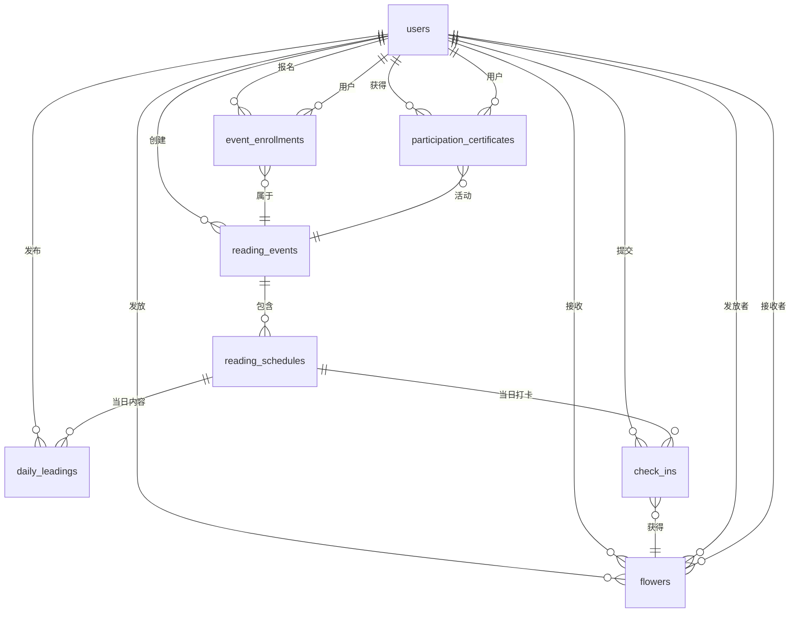

# QQClub 共读活动模块 - 数据库设计

## 📋 文档说明

**目标读者**: 数据库管理员、后端开发者
**文档内容**: 数据模型设计、表结构、关系图、索引优化

---

## 🗄️ 数据库设计原则

### 设计原则
- **数据完整性**: 通过外键约束确保数据一致性
- **查询性能**: 合理设计索引，优化常用查询
- **扩展性**: 预留扩展字段，支持未来功能
- **一致性**: 命名规范统一，结构清晰

### 命名规范
- **表名**: 复数形式，下划线分隔 (reading_events)
- **字段名**: 下划线分隔，语义清晰 (created_at)
- **索引名**: 表名_字段名索引 (idx_reading_events_status)
- **外键**: 表名_id (user_id, reading_event_id)

---

## 📊 核心数据表

### 1. reading_events 表 (共读活动)

#### 表结构
```sql
CREATE TABLE reading_events (
  id integer PRIMARY KEY AUTOINCREMENT,
  title varchar(100) NOT NULL,
  book_name varchar(100) NOT NULL,
  book_cover_url varchar(500),
  description text,
  activity_mode varchar(20) DEFAULT 'note_checkin',
  weekend_rest boolean DEFAULT false,
  completion_standard integer DEFAULT 80,
  leader_assignment_type varchar(20) DEFAULT 'voluntary',
  fee_type varchar(20) DEFAULT 'free',
  fee_amount decimal(10,2) DEFAULT 0.00,
  leader_reward_percentage decimal(5,2) DEFAULT 20.00,
  max_participants integer DEFAULT 25,
  min_participants integer DEFAULT 10,
  status integer DEFAULT 0,
  approval_status integer DEFAULT 0,
  start_date date NOT NULL,
  end_date date NOT NULL,
  enrollment_deadline datetime,
  leader_id integer NOT NULL,
  approved_by_user_id integer,
  approved_at datetime,
  created_at datetime NOT NULL,
  updated_at datetime NOT NULL,

  FOREIGN KEY (leader_id) REFERENCES users(id),
  FOREIGN KEY (approved_by_user_id) REFERENCES users(id)
);
```

#### 字段说明
| 字段名 | 类型 | 默认值 | 说明 |
|--------|------|--------|------|
| id | integer | - | 主键，自增 |
| title | varchar(100) | - | 活动标题 |
| book_name | varchar(100) | - | 书籍名称 |
| book_cover_url | varchar(500) | - | 书籍封面URL |
| description | text | - | 活动描述 |
| activity_mode | varchar(20) | 'note_checkin' | 活动模式 |
| weekend_rest | boolean | false | 周末休息设置 |
| completion_standard | integer | 80 | 完成率标准(60-100) |
| leader_assignment_type | varchar(20) | 'voluntary' | 领读方式 |
| fee_type | varchar(20) | 'free' | 费用类型 |
| fee_amount | decimal(10,2) | 0.00 | 费用金额 |
| leader_reward_percentage | decimal(5,2) | 20.00 | 小组长报酬比例 |
| max_participants | integer | 25 | 最大参与人数 |
| min_participants | integer | 10 | 最低参与人数 |
| status | integer | 0 | 活动状态 |
| approval_status | integer | 0 | 审批状态 |
| start_date | date | - | 开始日期 |
| end_date | date | - | 结束日期 |
| enrollment_deadline | datetime | - | 报名截止时间 |
| leader_id | integer | - | 小组长ID |
| approved_by_user_id | integer | - | 审批人ID |
| approved_at | datetime | - | 审批时间 |
| created_at | datetime | - | 创建时间 |
| updated_at | datetime | - | 更新时间 |

#### 枚举值
```sql
-- status 活动状态
-- 0: draft (草稿)
-- 1: enrolling (报名中)
-- 2: in_progress (进行中)
-- 3: completed (已完成)

-- approval_status 审批状态
-- 0: pending (待审批)
-- 1: approved (已批准)
-- 2: rejected (已拒绝)

-- activity_mode 活动模式
-- 'note_checkin': 笔记打卡
-- 'free_discussion': 自由讨论
-- 'video_conference': 视频会议
-- 'offline_meeting': 线下交流

-- leader_assignment_type 领读方式
-- 'voluntary': 自由领读
-- 'random': 随机领读
-- 'none': 无领读

-- fee_type 费用类型
-- 'free': 免费
-- 'deposit': 押金制
-- 'paid': 收费制
```

### 2. reading_schedules 表 (阅读计划)

#### 表结构
```sql
CREATE TABLE reading_schedules (
  id integer PRIMARY KEY AUTOINCREMENT,
  reading_event_id integer NOT NULL,
  day_number integer NOT NULL,
  date date NOT NULL,
  reading_progress varchar(200),
  daily_leader_id integer,
  created_at datetime NOT NULL,
  updated_at datetime NOT NULL,

  FOREIGN KEY (reading_event_id) REFERENCES reading_events(id),
  FOREIGN KEY (daily_leader_id) REFERENCES users(id),
  UNIQUE (reading_event_id, day_number)
);
```

#### 字段说明
| 字段名 | 类型 | 说明 |
|--------|------|------|
| id | integer | 主键，自增 |
| reading_event_id | integer | 关联的活动ID |
| day_number | integer | 第几天 |
| date | date | 具体日期 |
| reading_progress | varchar(200) | 阅读进度 |
| daily_leader_id | integer | 当日领读人ID |
| created_at | datetime | 创建时间 |
| updated_at | datetime | 更新时间 |

### 3. event_enrollments 表 (活动报名)

#### 表结构
```sql
CREATE TABLE event_enrollments (
  id integer PRIMARY KEY AUTOINCREMENT,
  reading_event_id integer NOT NULL,
  user_id integer NOT NULL,
  enrollment_type varchar(20) DEFAULT 'participant',
  status varchar(20) DEFAULT 'enrolled',
  enrollment_date datetime NOT NULL,
  completion_rate decimal(5,2) DEFAULT 0.00,
  check_ins_count integer DEFAULT 0,
  leader_days_count integer DEFAULT 0,
  flowers_received_count integer DEFAULT 0,
  fee_paid_amount decimal(10,2) DEFAULT 0.00,
  fee_refund_amount decimal(10,2) DEFAULT 0.00,
  refund_status varchar(20) DEFAULT 'pending',
  created_at datetime NOT NULL,
  updated_at datetime NOT NULL,

  FOREIGN KEY (reading_event_id) REFERENCES reading_events(id),
  FOREIGN KEY (user_id) REFERENCES users(id),
  UNIQUE (reading_event_id, user_id)
);
```

#### 字段说明
| 字段名 | 类型 | 默认值 | 说明 |
|--------|------|--------|------|
| id | integer | - | 主键，自增 |
| reading_event_id | integer | - | 关联的活动ID |
| user_id | integer | - | 用户ID |
| enrollment_type | varchar(20) | 'participant' | 参与类型 |
| status | varchar(20) | 'enrolled' | 报名状态 |
| enrollment_date | datetime | - | 报名时间 |
| completion_rate | decimal(5,2) | 0.00 | 完成率百分比 |
| check_ins_count | integer | 0 | 打卡次数 |
| leader_days_count | integer | 0 | 担任领读天数 |
| flowers_received_count | integer | 0 | 收到小红花数量 |
| fee_paid_amount | decimal(10,2) | 0.00 | 实付费用金额 |
| fee_refund_amount | decimal(10,2) | 0.00 | 费用退还金额 |
| refund_status | varchar(20) | 'pending' | 退款状态 |
| created_at | datetime | - | 创建时间 |
| updated_at | datetime | - | 更新时间 |

#### 枚举值
```sql
-- enrollment_type 参与类型
-- 'participant': 参与者
-- 'observer': 围观者

-- status 报名状态
-- 'enrolled': 已报名
-- 'completed': 已完成
-- 'cancelled': 已取消

-- refund_status 退款状态
-- 'pending': 待处理
-- 'refunded': 已退款
-- 'forfeited': 没收
```

### 4. daily_leadings 表 (领读内容)

#### 表结构
```sql
CREATE TABLE daily_leadings (
  id integer PRIMARY KEY AUTOINCREMENT,
  reading_schedule_id integer NOT NULL,
  leader_id integer NOT NULL,
  reading_suggestion text,
  questions text,
  created_at datetime NOT NULL,
  updated_at datetime NOT NULL,

  FOREIGN KEY (reading_schedule_id) REFERENCES reading_schedules(id),
  FOREIGN KEY (leader_id) REFERENCES users(id)
);
```

#### 字段说明
| 字段名 | 类型 | 说明 |
|--------|------|------|
| id | integer | 主键，自增 |
| reading_schedule_id | integer | 关联的阅读计划ID |
| leader_id | integer | 领读人ID |
| reading_suggestion | text | 阅读建议 |
| questions | text | 领读问题JSON格式 |
| created_at | datetime | 创建时间 |
| updated_at | datetime | 更新时间 |

### 5. check_ins 表 (打卡记录)

#### 表结构
```sql
CREATE TABLE check_ins (
  id integer PRIMARY KEY AUTOINCREMENT,
  user_id integer NOT NULL,
  reading_schedule_id integer NOT NULL,
  content text NOT NULL,
  word_count integer NOT NULL,
  status varchar(20) DEFAULT 'normal',
  submitted_at datetime NOT NULL,
  updated_at datetime NOT NULL,
  created_at datetime NOT NULL,

  FOREIGN KEY (user_id) REFERENCES users(id),
  FOREIGN KEY (reading_schedule_id) REFERENCES reading_schedules(id)
);
```

#### 字段说明
| 字段名 | 类型 | 默认值 | 说明 |
|--------|------|--------|------|
| id | integer | - | 主键，自增 |
| user_id | integer | - | 用户ID |
| reading_schedule_id | integer | - | 关联的阅读计划ID |
| content | text | - | 打卡内容 |
| word_count | integer | - | 字数统计 |
| status | varchar(20) | 'normal' | 打卡状态 |
| submitted_at | datetime | - | 提交时间 |
| updated_at | datetime | - | 更新时间 |
| created_at | datetime | - | 创建时间 |

#### 枚举值
```sql
-- status 打卡状态
-- 'normal': 正常打卡
-- 'supplement': 补卡
-- 'late': 迟到
```

### 6. flowers 表 (小红花)

#### 表结构
```sql
CREATE TABLE flowers (
  id integer PRIMARY KEY AUTOINCREMENT,
  check_in_id integer NOT NULL,
  giver_id integer NOT NULL,
  recipient_id integer NOT NULL,
  comment varchar(200),
  created_at datetime NOT NULL,

  FOREIGN KEY (check_in_id) REFERENCES check_ins(id),
  FOREIGN KEY (giver_id) REFERENCES users(id),
  FOREIGN KEY (recipient_id) REFERENCES users(id)
);
```

#### 字段说明
| 字段名 | 类型 | 说明 |
|--------|------|------|
| id | integer | 主键，自增 |
| check_in_id | integer | 关联的打卡ID |
| giver_id | integer | 发放者ID |
| recipient_id | integer | 接收者ID |
| comment | varchar(200) | 评语 |
| created_at | datetime | 创建时间 |

### 7. participation_certificates 表 (参与证书)

#### 表结构
```sql
CREATE TABLE participation_certificates (
  id integer PRIMARY KEY AUTOINCREMENT,
  reading_event_id integer NOT NULL,
  user_id integer NOT NULL,
  certificate_type varchar(50) NOT NULL,
  certificate_number varchar(100) UNIQUE NOT NULL,
  issued_at datetime NOT NULL,
  achievement_data text,
  certificate_url varchar(500),
  is_public boolean DEFAULT true,
  created_at datetime NOT NULL,
  updated_at datetime NOT NULL,

  FOREIGN KEY (reading_event_id) REFERENCES reading_events(id),
  FOREIGN KEY (user_id) REFERENCES users(id)
);
```

#### 字段说明
| 字段名 | 类型 | 说明 |
|--------|------|------|
| id | integer | 主键，自增 |
| reading_event_id | integer | 关联的阅读活动ID |
| user_id | integer | 获得证书的用户ID |
| certificate_type | varchar(50) | - | 证书类型 |
| certificate_number | varchar(100) | - | 证书编号，唯一标识 |
| issued_at | datetime | - | 颁发时间 |
| achievement_data | text | - | 成就数据JSON |
| certificate_url | varchar(500) | - | 证书图片URL |
| is_public | boolean | true | 是否公开显示 |
| created_at | datetime | - | 创建时间 |
| updated_at | datetime | - | 更新时间 |

#### 证书类型
```json
{
  "completion": {
    "name": "完成证书",
    "condition": "达到活动完成率标准"
  },
  "flower_top3": {
    "name": "小红花前三名证书",
    "condition": "获得小红花数量最多的前三名"
  },
  "custom": {
    "name": "自定义证书",
    "condition": "由小组长自由设定和颁发"
  }
}
```

---

## 🔗 关系图



---

## 📈 索引设计

### 主要索引
```sql
-- reading_events 表索引
CREATE INDEX idx_reading_events_status ON reading_events(status);
CREATE INDEX idx_reading_events_leader_id ON reading_events(leader_id);
CREATE INDEX idx_reading_events_start_date ON reading_events(start_date);
CREATE INDEX idx_reading_events_activity_mode ON reading_events(activity_mode);
CREATE INDEX idx_reading_events_fee_type ON reading_events(fee_type);

-- reading_schedules 表索引
CREATE INDEX idx_reading_schedules_event_id ON reading_schedules(reading_event_id);
CREATE INDEX idx_reading_schedules_date ON reading_schedules(date);
CREATE INDEX idx_reading_schedules_leader_id ON reading_schedules(daily_leader_id);

-- event_enrollments 表索引
CREATE INDEX idx_event_enrollments_event_id ON event_enrollments(reading_event_id);
CREATE INDEX idx_event_enrollments_user_id ON event_enrollments(user_id);
CREATE INDEX idx_event_enrollments_status ON event_enrollments(status);
CREATE INDEX idx_event_enrollments_type ON event_enrollments(enrollment_type);

-- check_ins 表索引
CREATE INDEX idx_check_ins_user_id ON check_ins(user_id);
CREATE INDEX idx_check_ins_schedule_id ON check_ins(reading_schedule_id);
CREATE INDEX idx_check_ins_submitted_at ON check_ins(submitted_at);

-- flowers 表索引
CREATE INDEX idx_flowers_giver_id ON flowers(giver_id);
CREATE INDEX idx_flowers_recipient_id ON flowers(recipient_id);
CREATE INDEX idx_flowers_check_in_id ON flowers(check_in_id);
CREATE INDEX idx_flowers_created_at ON flowers(created_at);

-- participation_certificates 表索引
CREATE INDEX idx_certificates_event_id ON participation_certificates(reading_event_id);
CREATE INDEX idx_certificates_user_id ON participation_certificates(user_id);
CREATE INDEX idx_certificates_type ON participation_certificates(certificate_type);
CREATE INDEX idx_certificates_number ON participation_certificates(certificate_number);
```

### 复合索引
```sql
-- 活动查询优化
CREATE INDEX idx_reading_events_status_mode ON reading_events(status, activity_mode);
CREATE INDEX idx_reading_events_dates ON reading_events(start_date, end_date);

-- 用户参与统计优化
CREATE INDEX idx_enrollments_user_event_status ON event_enrollments(user_id, reading_event_id, status);

-- 领读内容查询优化
CREATE INDEX idx_schedules_leader_date ON reading_schedules(daily_leader_id, date);
```

---

## 🔧 数据迁移

### 初始迁移文件
```ruby
# db/migrate/20251017000001_create_reading_events.rb
class CreateReadingEvents < ActiveRecord::Migration[7.0]
  def change
    create_table :reading_events do |t|
      t.string :title, null: false, limit: 100
      t.string :book_name, null: false, limit: 100
      t.string :book_cover_url, limit: 500
      t.text :description
      t.string :activity_mode, default: 'note_checkin'
      t.boolean :weekend_rest, default: false
      t.integer :completion_standard, default: 80
      t.string :leader_assignment_type, default: 'voluntary'
      t.string :fee_type, default: 'free'
      t.decimal :fee_amount, precision: 10, scale: 2, default: 0.0
      t.decimal :leader_reward_percentage, precision: 5, scale: 2, default: 20.0
      t.integer :max_participants, default: 25
      t.integer :min_participants, default: 10
      t.integer :status, default: 0
      t.integer :approval_status, default: 0
      t.date :start_date, null: false
      t.date :end_date, null: false
      t.datetime :enrollment_deadline
      t.references :leader, foreign_key: { to_table: :users }
      t.references :approved_by, foreign_key: { to_table: :users }
      t.datetime :approved_at
      t.timestamps
    end

    add_index :reading_events, :status
    add_index :reading_events, :leader_id
    add_index :reading_events, :activity_mode
    add_index :reading_events, :fee_type
  end
end
```

### 数据完整性约束
```ruby
# app/models/reading_event.rb
class ReadingEvent < ApplicationRecord
  validates :title, presence: true, length: { minimum: 5, maximum: 100 }
  validates :book_name, presence: true, length: { minimum: 2, maximum: 100 }
  validates :start_date, :end_date, presence: true
  validates :max_participants, numericality: {
    greater_than: 0,
    less_than_or_equal_to: 50
  }
  validates :fee_amount, numericality: {
    greater_than_or_equal_to: 0,
    less_than_or_equal_to: 500
  }
  validate :end_date_after_start_date

  private

  def end_date_after_start_date
    return if end_date.blank? || start_date.blank?

    if end_date < start_date
      errors.add(:end_date, "必须在开始日期之后")
    end
  end
end
```

---

## 🚀 性能优化

### 查询优化
```ruby
# 常用查询优化
class ReadingEvent < ApplicationRecord
  # 预加载关联
  scope :with_details, -> { includes(:leader, :enrollments => :user) }

  # 活动列表查询优化
  scope :filter_by_status, ->(status) { where(status: status) }
  scope :filter_by_mode, ->(mode) { where(activity_mode: mode) }
  scope :filter_by_fee_type, ->(fee_type) { where(fee_type: fee_type) }

  # 统计查询优化
  scope :with_statistics, -> {
    left_joins(:event_enrollments)
      .select('reading_events.*',
             'COUNT(CASE WHEN event_enrollments.status = 1 THEN 1 END) as participants_count',
             'AVG(event_enrollments.completion_rate) as avg_completion_rate'
      )
      .group('reading_events.id')
  }
end

# 用户统计优化
class User < ApplicationRecord
  def self.reading_statistics(event_id)
    enrollments = joins(:reading_event)
                 .where(reading_events: { id: event_id })

    {
      check_ins_count: enrollments.sum(:check_ins_count),
      flowers_count: enrollments.sum(:flowers_received_count),
      completion_rate: enrollments.average(:completion_rate) || 0
    }
  end
end
```

### 缓存策略
```ruby
# app/models/concerns/cacheable.rb
module Cacheable
  extend ActiveSupport::Concern

  def cache_key(prefix, *args)
    "#{prefix}_#{id}_#{args.join('_')}"
  end

  def cache_fetch(key, expires_in: 1.hour, &block)
    Rails.cache.fetch(key, expires: expires_in, &block)
  end
end

# app/models/reading_event.rb
class ReadingEvent < ApplicationRecord
  include Cacheable

  def completion_statistics
    cache_fetch('completion_stats', expires_in: 1.hour) do
      calculate_completion_statistics
    end
  end
end
```

---

## 📊 数据备份策略

### 备份方案
```bash
# 每日备份重要数据
#!/bin/bash
DATE=$(date +%Y%m%d)
BACKUP_DIR="/backups/qqclub"

# 备份共读活动相关表
pg_dump -h localhost -U postgres -d qqclub_development \
  -t reading_events \
  -t reading_schedules \
  -t event_enrollments \
  -t check_ins \
  -t flowers \
  -t participation_certificates \
  > "${BACKUP_DIR}/reading_events_${DATE}.sql"

# 保留最近30天的备份
find "${BACKUP_DIR}" -name "reading_events_*.sql" -mtime +30 -delete
```

### 数据恢复
```bash
# 恢复特定日期的数据
psql -h localhost -U postgres -d qqclub_development \
  -f "/backups/qqclub/reading_events_20251017.sql"
```

---

## 🔍 监控和维护

### 数据质量检查
```ruby
# lib/tasks/data_quality.rake
namespace :data do
  task :check_integrity => :environment do
    # 检查外键完整性
    check_foreign_key_integrity

    # 检查数据一致性
    check_data_consistency

    # 检查重复数据
    check_duplicate_data
  end

  private

  def check_foreign_key_integrity
    puts "检查外键完整性..."

    # 检查孤立的活动报名记录
    orphaned_enrollments = EventEnrollment.where.missing(:reading_event)
    if orphaned_enrollments.exists?
      puts "发现 #{orphaned_enrollments.count} 条孤立的报名记录"
    end

    # 检查孤立的打卡记录
    orphaned_check_ins = CheckIn.where.missing(:reading_schedule)
    if orphaned_check_ins.exists?
      puts "发现 #{orphaned_check_ins.count} 条孤立的打卡记录"
    end
  end
end
```

### 性能监控
```sql
-- 慢查询监控
SELECT query, calls, total_time, rows,
       (total_time/calls) as avg_time
FROM pg_stat_statements
WHERE query LIKE '%reading_events%'
  OR query LIKE '%check_ins%'
  OR query LIKE '%flowers%'
ORDER BY total_time DESC
LIMIT 10;

-- 表大小监控
SELECT
  schemaname,
  tablename,
  pg_size_pretty(pg_total_relation_size(schemaname||'.'||tablename)) AS size
FROM pg_tables
WHERE schemaname = 'public'
  AND (
    tablename LIKE '%reading%'
    OR tablename LIKE '%enrollment%'
    OR tablename LIKE '%certificate%'
  )
ORDER BY pg_total_relation_size(schemaname||'.'||tablename) DESC;
```

---

## 📋 版本控制

### 数据库版本
```sql
-- 创建版本记录表
CREATE TABLE schema_versions (
  version varchar(50) PRIMARY KEY,
  description text,
  executed_at timestamp DEFAULT CURRENT_TIMESTAMP
);

-- 记录版本
INSERT INTO schema_versions (version, description) VALUES
('20251017_01_create_reading_events', '创建共读活动相关表');
INSERT INTO schema_versions (version, description) VALUES
('20251017_02_add_certificates', '添加证书表');
```

---

*本文档最后更新: 2025-10-17*