# 服务依赖关系分析

## 概述
本文档分析了QQClub项目中服务层的依赖关系，识别了潜在的耦合问题，并提供了优化建议。

## 完整服务依赖关系图

### 核心服务分类

#### 1. 基础设施服务 (Infrastructure Services)
- **ApplicationService**: 所有服务的基类
- **CacheService**: 缓存管理
- **PaginationService**: 分页处理
- **QueryOptimizationService**: 查询优化
- **ApiResponseService**: API响应标准化
- **ApiVersionService**: API版本控制
- **ErrorHandlingService**: 错误处理

#### 2. 业务核心服务 (Core Business Services)
- **PostManagementService**: 帖子管理（协调器）
- **ContentModerationService**: 内容审核（协调器）
- **FlowerIncentiveService**: 小红花激励系统（协调器）
- **AuthenticationService**: 用户认证
- **NotificationService**: 通知管理
- **AnalyticsService**: 数据分析

#### 3. 功能模块服务 (Feature Services)

##### 帖子系统
- **PostCreationService**: 帖子创建
- **PostUpdateService**: 帖子更新
- **PostModerationService**: 帖子审核
- **PostDataService**: 帖子数据格式化
- **PostPermissionService**: 帖子权限检查

##### 内容审核系统
- **ReportCreationService**: 举报创建
- **ReportProcessingService**: 举报处理
- **ContentModerationQueryService**: 审核查询
- **ContentModerationAnalyticsService**: 审核统计
- **ModerationNotificationService**: 审核通知

##### 小红花系统
- **FlowerGivingService**: 小红花赠送
- **FlowerQuotaService**: 配额管理
- **FlowerStatisticsService**: 统计分析
- **FlowerCertificateService**: 证书管理
- **FlowerCommentService**: 评论管理
- **DailyFlowerStatsService**: 每日统计

##### 活动管理
- **EventManagementService**: 活动生命周期
- **EventEnrollmentService**: 活动报名
- **LeaderAssignmentService**: 领读人分配
- **ActivityApprovalWorkflowService**: 审批流程

##### 支持服务
- **AvatarGeneratorService**: 头像生成
- **ContentFormatterService**: 内容格式化
- **ContentSearchService**: 内容搜索
- **SocialShareService**: 社交分享

### 服务依赖关系图

```mermaid
graph TD
    %% 基础设施层
    ApplicationService --> |继承| PostManagementService
    ApplicationService --> |继承| ContentModerationService
    ApplicationService --> |继承| NotificationService
    ApplicationService --> |继承| PostCreationService
    ApplicationService --> |继承| PostUpdateService
    ApplicationService --> |继承| PostModerationService
    ApplicationService --> |继承| PostDataService
    ApplicationService --> |继承| PostPermissionService
    ApplicationService --> |继承| ReportCreationService
    ApplicationService --> |继承| ReportProcessingService
    ApplicationService --> |继承| ContentModerationQueryService
    ApplicationService --> |继承| ContentModerationAnalyticsService
    ApplicationService --> |inheritance| AnalyticsService
    ApplicationService --> |inheritance| CacheService
    ApplicationService --> |inheritance| PaginationService
    ApplicationService --> |inheritance| QueryOptimizationService
    ApplicationService --> |inheritance| ApiResponseService
    ApplicationService --> |inheritance| AuthenticationService

    %% 业务协调层
    PostManagementService --> |调用| PostCreationService
    PostManagementService --> |调用| PostUpdateService
    PostManagementService --> |调用| PostModerationService
    PostManagementService --> |调用| PostDataService
    PostManagementService --> |调用| PostPermissionService

    ContentModerationService --> |调用| ReportCreationService
    ContentModerationService --> |调用| ReportProcessingService
    ContentModerationService --> |调用| ContentModerationQueryService
    ContentModerationService --> |调用| ContentModerationAnalyticsService

    %% 功能服务间依赖
    FlowerGivingService --> |调用| FlowerQuotaService
    FlowerGivingService --> |调用| NotificationService
    FlowerGivingService --> |调用| EventEnrollmentService

    PostDataService --> |调用| PostPermissionService

    NotificationService --> |调用| ErrorHandlingService

    PaginationService --> |调用| QueryOptimizationService

    %% 基础设施依赖
    CacheService --> |调用| AnalyticsService
    CacheService --> |调用| FlowerQuotaService

    %% 认证服务依赖
    AuthenticationService --> |调用| AvatarGeneratorService

    %% 内容格式化依赖
    ReportCreationService --> |调用| ContentFormatterService
```



## 识别的依赖问题

### 1. 高耦合问题

#### 1.1 PostManagementService 过度耦合
- **问题**: 依赖几乎所有的帖子相关服务
- **影响**: 违反单一职责原则，难以维护和测试
- **位置**: `qqclub_api/app/services/post_management_service.rb:123-144`

#### 1.2 NotificationService 横切依赖
- **问题**: 被多个不同模块的服务调用
- **影响**: 修改通知逻辑可能影响多个业务模块
- **调用位置**:
  - `flower_giving_service.rb:162`
  - `flower_comment_service.rb:283`

#### 1.3 FlowerIncentiveService 简单委托模式
- **问题**: 大部分方法都是简单委托，缺乏实际价值
- **影响**: 增加了不必要的抽象层
- **建议**: 考虑直接使用具体服务或重新设计其职责

### 2. 潜在循环依赖

#### 2.1 权限检查循环
```
PostDataService -> PostPermissionService -> (可能需要)PostDataService
```

#### 2.2 通知循环
```
任何服务 -> NotificationService -> (可能需要)发起服务的信息
```

### 3. 基础设施服务被业务服务直接依赖

#### 3.1 CacheService 被直接调用
- **问题**: 业务逻辑直接依赖缓存实现
- **建议**: 使用仓储模式或服务门面

## 优化建议

### 1. 引入事件系统

使用Rails的`ActiveSupport::Notifications`或自定义事件系统来解耦服务间依赖：

```ruby
# 替代直接服务调用
class FlowerGivingService
  def give_flower_with_confirmation(...)
    # ... 赠送逻辑 ...

    # 发布事件而不是直接调用通知服务
    ActiveSupport::Notifications.publish(
      'flower.given',
      giver: giver,
      recipient: recipient,
      flower: flower
    )
  end
end

# 通知服务订阅事件
class NotificationService
  ActiveSupport::Notifications.subscribe('flower.given') do |*args|
    event = ActiveSupport::Notifications::Event.new(*args)
    send_flower_notification(
      event.payload[:recipient],
      event.payload[:giver],
      event.payload[:flower]
    )
  end
end
```

### 2. 重新设计服务层次

```ruby
# 建议的服务层次结构
module Services
  # 基础设施层
  module Infrastructure
    class CacheService; end
    class PaginationService; end
    # ... 其他基础设施服务
  end

  # 领域服务层
  module Domain
    module Posts
      class PostService; end          # 领域服务
      class PostRepository; end      # 仓储
    end

    module Flowers
      class FlowerService; end
      class FlowerRepository; end
    end

    module Users
      class UserService; end
      class UserRepository; end
    end
  end

  # 应用服务层
  module Application
    class PostManagementService; end   # 应用服务
    class FlowerIncentiveService; end
  end

  # 接口层
  module Interfaces
    class NotificationInterface; end   # 接口适配器
  end
end
```

### 3. 使用依赖注入

```ruby
class PostManagementService
  def initialize(
    post_creation_service: PostCreationService.new,
    post_update_service: PostUpdateService.new,
    post_moderation_service: PostModerationService.new,
    notification_interface: Interfaces::NotificationInterface.new
  )
    @post_creation_service = post_creation_service
    @post_update_service = post_update_service
    @post_moderation_service = post_moderation_service
    @notification_interface = notification_interface
  end

  def create_post(params)
    result = @post_creation_service.call(params)
    @notification_interface.post_created(result.post) if result.success?
    result
  end
end
```

### 4. 引入仓储模式

```ruby
class PostRepository
  def find(id)
    # 使用缓存
    CacheService.fetch("post_#{id}") do
      Post.includes(:user, :comments).find(id)
    end
  end

  def find_by_user(user_id, page: 1, per_page: 20)
    # 使用分页服务
    PaginationService.paginate(
      Post.where(user_id: user_id),
      page: page,
      per_page: per_page
    )
  end
end
```

### 5. 具体实施建议

#### 5.1 引入服务缓存
```ruby
# 在权限检查服务中添加缓存支持
class PostPermissionService < ApplicationService
  include ServiceInterface

  def self.can_edit_cached?(post, user, cache_options = {})
    cache_key = "post_permission:edit:#{post.id}:#{user.id}"
    Rails.cache.fetch(cache_key, expires_in: cache_options[:expires_in] || 5.minutes) do
      new(post: post, user: user, action: :edit).can_perform?
    end
  end
end
```

#### 5.2 批量操作优化
```ruby
# 在PostDataService中添加批量权限检查
def self.batch_generate_interaction_states(posts, current_user)
  post_ids = posts.map(&:id)
  permissions = batch_check_posts_permissions(post_ids, current_user.id)

  posts.map do |post|
    {
      post_id: post.id,
      liked: post.liked_by?(current_user),
      bookmarked: post.bookmarked_by?(current_user),
      can_edit: permissions.dig(post.id, :edit) || false,
      can_delete: permissions.dig(post.id, :delete) || false,
      can_pin: permissions.dig(post.id, :pin) || false,
      can_hide: permissions.dig(post.id, :hide) || false,
      can_comment: permissions.dig(post.id, :comment) || false
    }
  end
end
```

#### 5.3 服务门面模式
```ruby
# 创建统一的服务门面，简化控制器调用
class PostServiceFacade < ApplicationService
  include ServiceInterface

  def self.create_with_data(user, params, current_user: nil)
    creation_result = PostCreationService.new(user: user, post_params: params).call
    return creation_result unless creation_result.success?

    post = creation_result.data[:post]
    formatted_data = PostDataService.format_post(post, current_user: current_user || user)

    success!({
      post: formatted_data,
      message: "帖子创建成功"
    })
  end
end
```

## 实施计划

### Phase 1: 引入事件系统 (1-2周)
1. 实现基础事件发布订阅机制
2. 在NotificationService中实现事件订阅
3. 逐步替换直接的服务调用
4. 重点：FlowerGivingService -> NotificationService解耦

### Phase 2: 重构服务层次 (2-3周)
1. 重新组织服务到合适的模块
2. 引入仓储模式
3. 实现依赖注入容器
4. 重点：PostManagementService职责分离

### Phase 3: 优化协调器服务 (1-2周)
1. 重新评估协调器服务的价值
2. 拆分过大的协调器
3. 移除不必要的委托层
4. 重点：FlowerIncentiveService重构

### Phase 4: 性能优化 (1周)
1. 实施服务缓存机制
2. 添加批量操作支持
3. 建立服务性能监控

## 测试验证

- 验证服务缓存命中率 > 80%
- 测试批量操作性能提升 > 50%
- 确保服务门面不影响现有功能
- 建立服务依赖监控告警
- 单元测试覆盖率 > 95%

## 结论

当前的服务依赖关系存在以下主要问题：
1. **过度耦合**，特别是协调器服务
2. **缺乏清晰的层次结构**
3. **基础设施服务被业务服务直接依赖**
4. **缺乏事件驱动机制来解耦**

通过引入事件系统、重新设计服务层次、使用依赖注入和仓储模式，可以显著改善系统的可维护性和可测试性。建议按照上述实施计划逐步优化，确保系统稳定性的同时提升代码质量。